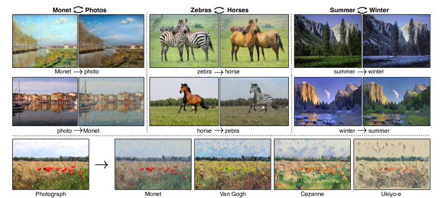
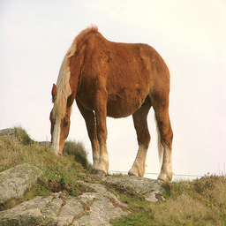
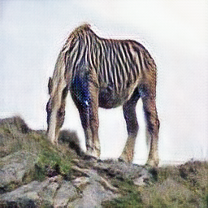
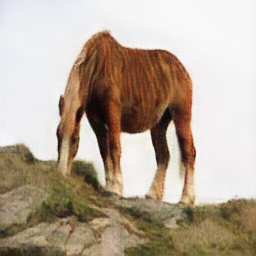
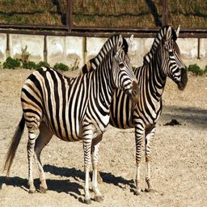
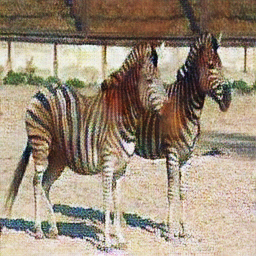
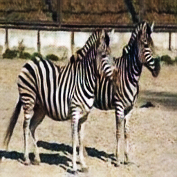

# CycleGAN-pytorch
This repo is a pytorch implementation of 
[Unpaired Image-to-Image Translation using Cycle-Consistent Adversarial Networks
(CycleGAN)](https://arxiv.org/abs/1703.10593) on [zebras <-> horses dataset](https://www.kaggle.com/datasets/suyashdamle/cyclegan)



GANs, also known as Generative Adversarial Networks, are one of the most fascinating new developments in deep learning.
Yann LeCun saw GANs as "the most fascinating idea in the last 10 years in ML" when Ian Goodfellow and Yoshua Bengio from the University of Montreal first unveiled them in 2014.
GANS are frequently used to make deep fake films, improve the quality of images, face swap, design gaming characters, and much more. 

The CycleGAN is a technique that involves the automatic training of image-to-image translation models without paired examples. The models are trained in an unsupervised manner using a collection of images from the source and target domain that do not need to be related in any way

# Setup and Generate
This code is developed under following library dependencies
```commandline
python 3.8
torch 1.11.0
torchvision 0.12.0
```
Start with creating a virtual environment then open your terminal and follow the following steps:
```commandline
git clone "https://github.com/zaghlol94/CycleGAN-pytorch"
cd CycleGAN-pytorch
pip install -r requirements.txt
bash download_assets.sh
cd src
python generate.py -i "input image path" -s "horse" or "zebra"  
ex: python generate.py -i "results/horse_test.png" -s "horse"
```

## Dataset
This is the unpaired-images dataset for training CycleGANs - horse-zebra.
The data folder contains two folders: ```train``` and ```val``` every folder contains two folders ```trainA``` and ```trainB``` one of them contains the horses images and the second contains the zebras images.
download the dataset from [here](https://www.kaggle.com/datasets/suyashdamle/cyclegan)


```commandline.
src
└── data
    ├── train
    │   ├── trainA
    │   │   ├── n02381460_11.jpg
    │   │   ├── n02381460_14.jpg
    │   │   ├── .
    │   │   ├── .
    │   │   ├── .
    │   │   ├── .
    │   │   └── n02381460_9263.jpg
    │   └── trainB
    │       ├── n02391049_11181.jpg
    │       ├── n02391049_11195.jpg
    │       ├── .
    │       ├── .
    │       ├── .
    │       ├── .
    │       └── n02391049_7.jpg
    └── val
        ├── testA
        │   ├── n02381460_120.jpg
        │   ├── n02381460_20.jpg
        │   ├── .
        │   ├── .
        │   ├── .
        │   └── n02381460_9260.jpg
        └── testB
            ├── n02391049_100.jpg
            ├── n02391049_10910.jpg
            ├── .
            ├── .
            ├── .
            └── n02391049_80.jpg
```
## Training
Download horse->zebra dataset and add the images' folder in ```src/data```
if you rename the root folder of the dataset don't forget to change the ````TRAIN_DIR```` and ```VAL_DIR```
variable in [config.py](https://github.com/zaghlol94/CycleGAN-pytorch/blob/main/src/config.py)
```commandline
cd src
python train.py
```
# Results
the first image represents the input, while the second represents the fake image from the algorithm and the third 
image is the reconstructed 
<p float="left">
  
   
  
</p>

<p float="left">
  
   
  
</p>

# Citation
```commandline
@misc{https://doi.org/10.48550/arxiv.1703.10593,
  doi = {10.48550/ARXIV.1703.10593},
  
  url = {https://arxiv.org/abs/1703.10593},
  
  author = {Zhu, Jun-Yan and Park, Taesung and Isola, Phillip and Efros, Alexei A.},
  
  keywords = {Computer Vision and Pattern Recognition (cs.CV), FOS: Computer and information sciences, FOS: Computer and information sciences},
  
  title = {Unpaired Image-to-Image Translation using Cycle-Consistent Adversarial Networks},
  
  publisher = {arXiv},
  
  year = {2017},
  
  copyright = {arXiv.org perpetual, non-exclusive license}
}
```